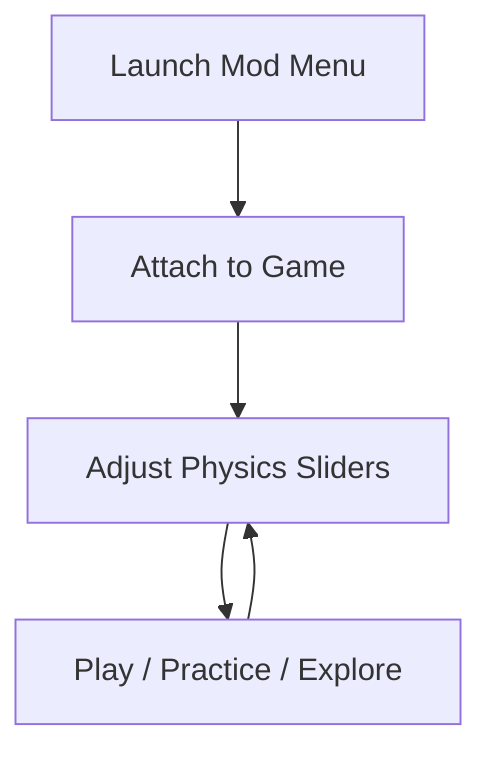

# BALL x PIT Mod Menu 

Steel hums. Gravity hesitates. A ball rolls toward the edge and, for a heartbeat, the world listens.
**BALL x PIT Mod Menu** is a gentle lever on that moment—a way to slow it, stretch it, or let it fall faster, exactly as you choose.

Built as a compact single-player companion for **BALL x PIT**, this mod menu invites experimentation without erasing challenge. It’s a tuning desk for motion and momentum, a place where practice becomes play and play becomes understanding.

---

## 🌒 Overview

The Mod Menu runs externally on Windows, offering real-time toggles and sliders. Nothing is permanent. Nothing is forced. You open a control, feel the change, then close it again—like adjusting the strings of an instrument before the performance.

Use it to:

* Practice tight sections without repetition fatigue
* Explore levels with altered physics
* Record cinematic or speedrun routes
* Learn *why* a jump fails, not just that it failed

---

## 🧩 Mod Menu Features

### ⚙️ Physics Tuning

* **Gravity Scale**: lighter float or heavier pull
* **Ball Speed Multiplier**: micro-adjust acceleration
* **Friction Control**: slick glass to gritty stone
* **Bounce Intensity**: soften landings or exaggerate arcs

### 🧭 Movement & Flow

* **Freeze Position** (study angles and slopes)
* **Time Scale** (slow motion for precision learning)
* **Checkpoint Warp** (practice a single segment)

### 🧪 Practice Utilities

* **Invulnerability Toggle** (no resets on mistakes)
* **Instant Reset** (quick retry without reload)
* **Ghost Path** (optional trail to review movement)

### 🎥 Creative & Capture

* Camera distance slider
* UI hide for clean footage
* Smooth pan mode for showcase runs

[!NOTE]
Every option is modular. Enable one slider, or build a full sandbox—your hands decide.

---

## ⚡ Setup (Windows)

1. Download the BALL x PIT Mod Menu build
2. Extract to a trusted folder
3. Launch the Mod Menu **before** the game
4. Start BALL x PIT
5. Press the menu hotkey to open controls

Sample hotkeys:

```ini
[Hotkeys]
MenuToggle = INSERT
Gravity    = F1
Speed      = F2
TimeScale  = F3
Checkpoint = F4
Freeze     = F5
```

[!IMPORTANT]
Run as Administrator to ensure stable attachment and instant response.

---

## 🧠 How It Works



No reloads.
No scene breaks.
Just continuous motion.

---

## ❓ FAQ

**Is this meant for single-player only?**
Yes. The Mod Menu is designed for offline, personal experimentation.

**Will it ruin the challenge?**
Only if you let it. Many players use slow motion or gravity tweaks to *learn*, then restore defaults for clean runs.

**Can I revert instantly?**
Absolutely. Disable toggles or close the menu—physics returns to normal.

**Does it help speedrunning?**
Yes. It’s excellent for route testing, angle discovery, and muscle-memory practice.

---

## 🌗 Final Thoughts

BALL x PIT is a conversation between mass and motion. Sometimes you want to argue with it. Sometimes you want to listen more closely. **BALL x PIT Mod Menu** gives you the quiet space to do both.

Lighten the fall.
Freeze the moment.
Learn the curve of the pit—
then roll through it, unassisted, with confidence earned.

---
